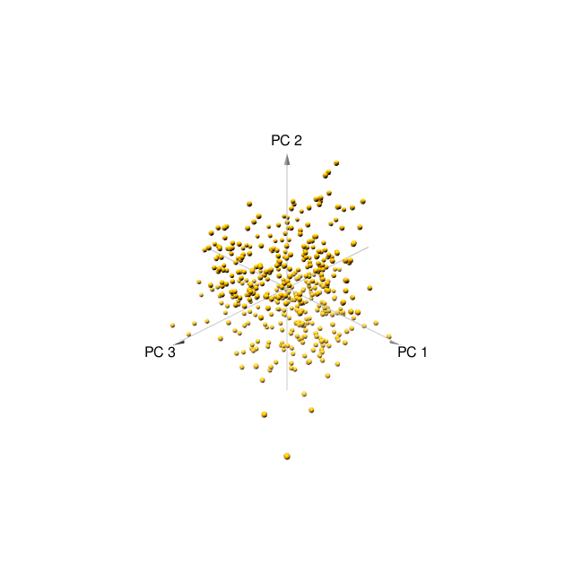
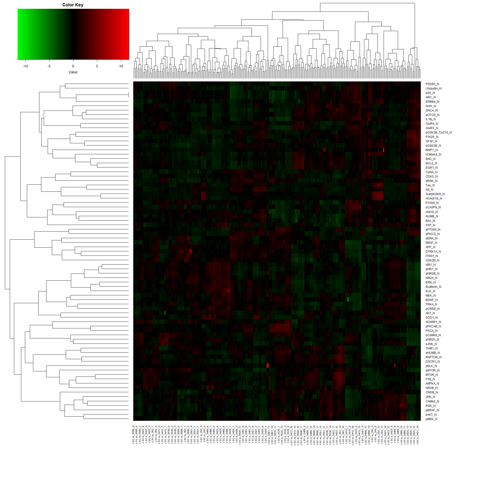
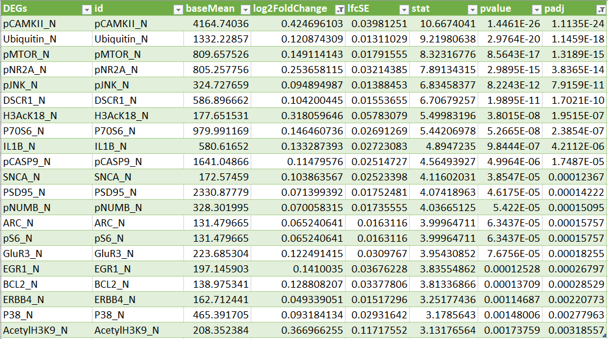
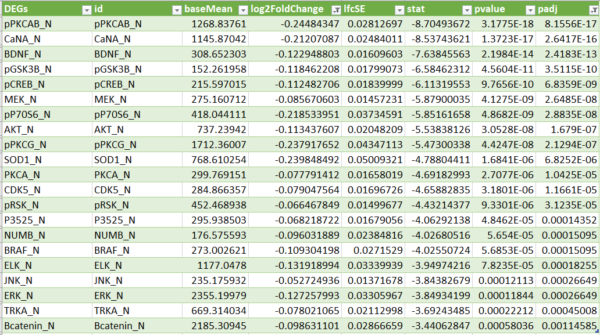
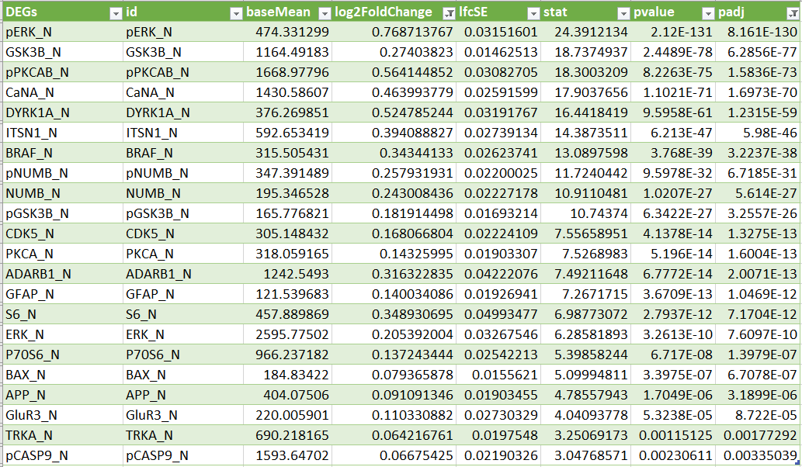
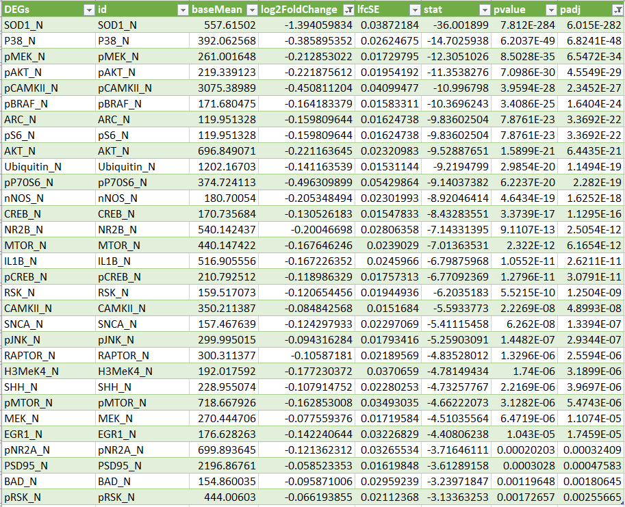
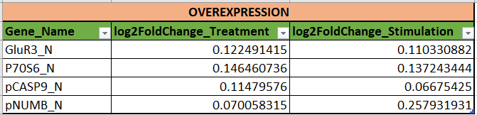
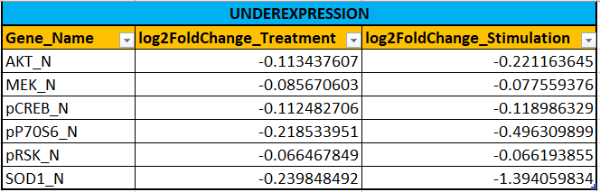

```{r setup, include=FALSE}
knitr::opts_chunk$set(echo = TRUE)
```

## Data Set Information

The data set consists of the expression levels of 77 proteins/protein modifications that produced detectable signals in the nuclear fraction of cortex. There are 38 control mice and 34 trisomic mice (Down syndrome), for a total of 72 mice. In the experiments, 15 measurements were registered of each protein per sample/mouse. Therefore, for control mice, there are 38x15, or 570 measurements, and for trisomic mice, there are 34x15, or 510 measurements. The dataset contains a total of 1080 measurements per protein. Each measurement can be considered as an independent sample/mouse.

The eight classes of mice are described based on features such as genotype, behavior and treatment. According to genotype, mice can be control or trisomic. According to behavior, some mice have been stimulated to learn (context-shock) and others have not (shock-context) and in order to assess the effect of the drug memantine in recovering the ability to learn in trisomic mice, some mice have been injected with the drug and others have not.

Classes:

- c-CS-s: control mice, stimulated to learn, injected with saline (9 mice)
- c-CS-m: control mice, stimulated to learn, injected with memantine (10 mice)
- c-SC-s: control mice, not stimulated to learn, injected with saline (9 mice)
- c-SC-m: control mice, not stimulated to learn, injected with memantine (10 mice)

- t-CS-s: trisomy mice, stimulated to learn, injected with saline (7 mice)
- t-CS-m: trisomy mice, stimulated to learn, injected with memantine (9 mice)
- t-SC-s: trisomy mice, not stimulated to learn, injected with saline (9 mice)
- t-SC-m: trisomy mice, not stimulated to learn, injected with memantine (9 mice)

The aim is to identify subsets of proteins that are discriminant between the classes.


## EDA (5 points)

Make a description of the dataset:

- how many mice were in the experiment
- which groups can you identify
- how balanced are these groups
- how many complete observations (without NA)

```{r, message=FALSE, warning=FALSE}
library(dplyr)
library(caret)
library("readxl")
library(psych)
library(tidyr)
```

```{r}
m_df <- read_excel("..\\data_folder\\Data_Cortex_Nuclear.xls")
describe(m_df)
```

**- how many mice were in the experiment?**
```{r}
m_m <- strsplit(m_df$MouseID, "_")
m_m_u <- unique(do.call(rbind, m_m)[,1])
length(m_m_u)
```


**- which groups can you identify**
```{r}
unique(m_df$class)
```

**- how balanced are these groups**
```{r}
# Simple Bar Plot
counts <- table(m_df$class)
barplot(counts, main="Observations pre class",
   xlab="Number of Classes")
```
<br>
The class distribution looks balanced enough for Linear regression.


**- how many complete observations (without NA)**
```{r}
completerecords <- na.omit(m_df)
nrow(completerecords)
```

## Task 2
**Are there any differences in the level of production of BDNF_N depending on the class in the experiment (10 points)**

```{r, message=FALSE, warning=FALSE} 
data_summary <- function(data, varname, groupnames){
  require(plyr)
  summary_func <- function(x, col){
    c(mean = mean(x[[col]], na.rm=TRUE),
      sd = sd(x[[col]], na.rm=TRUE))
  }
  data_sum<-ddply(data, groupnames, .fun=summary_func,
                  varname)
 return(data_sum)
}
```

```{r, message=FALSE, warning=FALSE} 
bdnf_data <- data_summary(m_df, varname="BDNF_N", 
                    groupnames=("class"))
# Convert class to a factor variable
bdnf_data$class=as.factor(bdnf_data$class)
head(bdnf_data)
```


```{r, message=FALSE, warning=FALSE} 
library(ggplot2)
p<- ggplot(bdnf_data, aes(x=class, y=mean, fill=class)) + 
  geom_bar(stat="identity", color="black", 
           position=position_dodge()) +
  geom_errorbar(aes(ymin=mean-sd, ymax=mean+sd), width=.2,
                 position=position_dodge(.9)) 

p+labs(title="Levels of BDNF_N production per class", x="Class", y = "Expression")+
   theme_classic()
```


## Task 3
**Try to build a linear model that can predict the level of production of the ERBB4_N protein **
**based on data on other proteins in the experiment (15 points)**

- to diagnose the resulting linear model
- explain why this is a good/not good solution

```{r}
# cutting the prediction parameters
drop <- c("MouseID", "Genotype",	"Treatment", "Behavior",	"class")
X_m_df <- completerecords[,!(names(completerecords) %in% drop)]
```


```{r}
#split data into training and test
set.seed(666)

sample <- sample.int(n = nrow(X_m_df), size = floor(.8*nrow(X_m_df)), replace = F)

train <-  X_m_df[sample, ]
test <-  X_m_df[-sample, ]
```


• Standardize your data (but not the target variable). 
```{r}
# names of variables I don't want to scale
varnames <- c("ERBB4_N")

# index vector of columns which must not be scaled
index <- names(train) %in% varnames

# scale only the columns not in index
temp <- scale(train[, !index])
train[, !index] <- temp

# get the means and standard deviations from temp, to scale test too
means <- attr(temp, "scaled:center")
standard_deviations <- attr(temp, "scaled:scale")

# scale test
test[, !index] <- scale(test[, !index], center = means, scale = standard_deviations)
```


• Build a linear model that can predict the level of production of the ERBB4_N protein based on data on other proteins in the experiment
```{r}
#Build Model
model <- lm(ERBB4_N ~ . - ERBB4_N, data=train)

# Adjusted R-squared:  0.844
summary(model)

# predict using the Model
predictions <- model %>% predict(subset(test, select = -ERBB4_N))
predictions

compare <- data.frame(actual = test$ERBB4_N,
                      predicted = predictions)
compare

# 0.006441225
error <- RMSE(predictions, test$ERBB4_N)
error
```

**Results: ** In our case the model predicts almost perfectly - as we can see the **Adjusted R-squared = 0.844** 
with **Root Mean Square Error (RMSE) = 0.006441225**.
Although our model gives a good results, in general, using the gene co-expression as a predictive model [PMID: 15173114] is not the best choice.
This is because co-expression itself tends to change in different conditions, for example, pathological [PMID: 15863494, PMID: 17987795, PMID: 26527747].


## Task 4
**Do a PCA (15 points)**

- ordination
- plot factor loads
- determine what percentage each component explains
- build a 3D plot for the first 3 components 


```{r, message=FALSE, warning=FALSE}
#install.packages("vegan")
library(vegan)
```


```{r}
# Principal Component Analysis:
train_pc <- prcomp(train, scale = TRUE)

#compute standard deviation of each principal component
std_dev <- train_pc$sdev

#compute variance
pr_var <- std_dev^2

#check variance of first 10 components
pr_var[1:10]

#proportion of variance explained
prop_varex <- pr_var/sum(pr_var)
prop_varex[1:20]

#scree plot
plot(prop_varex, xlab = "Principal Component",
     ylab = "Proportion of Variance Explained",
     type = "b")

#cumulative scree plot
plot(cumsum(prop_varex), xlab = "Principal Component",
       ylab = "Cumulative Proportion of Variance Explained",
       type = "b")


eigenvals(train_pc)

#let's check broken stick plot
bstick(train_pc)
screeplot(train_pc, type = "lines", bstick = TRUE)
```

**Results:** as we can see from the **broken stick plot**, the **first 4 PCs** will be useful for a New  model.


```{r}
biplot(train_pc, cex = 0.5, asp = 1)
```

The direction of the red arrows shows the relationships among the 11 different variables. Intuitively, variables
with arrows pointing in similar directions are positively correlated, while those pointing in opposite directions
are negatively correlated


```{r}
print(train_pc$rotation[,1:4])
```

To get the direction of the arrows, we need to multiply the loadings in train_pc\$rotation above
by the standard deviation of each principle component in train_pc\$sdev:
```{r}
biplot(train_pc, cex = 0.4, asp = 1);
# Note that the arrows are scaled by a factor of ca 17, hence the scaling below
points(x = 17 * train_pc$sdev[1] * train_pc$rotation[,1],
y = 17 * train_pc$sdev[2] * train_pc$rotation[,2],
col = "blue", pch = 20, cex = 1.5)
```


```{r}
summary(train_pc)
```


**Results:** Major importance
PC1 ~ 30%
PC2 ~ 18%
PC3 ~ 10%
PC4 ~ 9%

Four first principal components explain ~67 percent of the variability in the input data.


```{r, message=FALSE, warning=FALSE}
library(pca3d)
```

```{r}
# pca3d(train_pc) #, group=gr)
# snapshotPCA3d(file="pca3d_plot.png")
```



## Task 5
**Search for differential proteins - the creative part of the task (15 points)**

- you can do a reanalysis from the article, but there is machine learning
- one of the solutions is to use directed ordination methods
- you can use limma/DeSeq2


### New groups for analysis:

**DEGs after treatment**

Non-treatment:

- c-SC-s: control mice, not stimulated to learn, injected with saline (9 mice)
- t-SC-s: trisomy mice, not stimulated to learn, injected with saline (9 mice)


Treatment:

- c-SC-m: control mice, not stimulated to learn, injected with memantine (10 mice)
- t-SC-m: trisomy mice, not stimulated to learn, injected with memantine (9 mice)


**DEGs after stimulation**

Non-stimulated:

- c-SC-s: control mice, not stimulated to learn, injected with saline (9 mice)
- t-SC-s: trisomy mice, not stimulated to learn, injected with saline (9 mice)


Stimulated:

- c-CS-s: control mice, stimulated to learn, injected with saline (9 mice)
- t-CS-s: trisomy mice, stimulated to learn, injected with saline (7 mice)

```{r}
completerecords$new_index <- paste(completerecords$class, completerecords$MouseID, sep = "_")
```

```{r, message=FALSE, warning=FALSE}
library(data.table)
```

### DEGs after treatment

```{r}
# Set up the conditions based on the experimental setup.
names_nt  <-  c("c-SC-s", "t-SC-s")
names_t  <- c("c-SC-m", "t-SC-m")


non_tr <- rep("non_treatment", 2)
tr <- rep("treatment", 2)

samples <- c(names_nt, names_t)

condition <- factor(c(non_tr, tr))

colData = data.frame(samples=samples, condition=condition)
colData
```


```{r}
new_colData <- colData
colnames(new_colData) <- c("class", "condition")

new_completerecords <- merge(y=new_colData, x=completerecords, by="class", all.y = TRUE)

ind <- new_completerecords$new_index
new_drop <- c("MouseID", "Genotype",	"Treatment", "Behavior",	"class", "new_index", "condition")
new_m_df <- new_completerecords[,!(names(new_completerecords) %in% new_drop)]

new_m_df_trsp <- transpose(new_m_df)
```


```{r}
colnames(new_m_df_trsp) <- ind
rownames(new_m_df_trsp) <- colnames(new_m_df)
```


```{r}
new_colData2 <- new_completerecords[,(names(new_completerecords) %in% c("new_index", "condition"))]
colnames(new_colData2) <- c("samples", "condition")
```

```{r, message=FALSE, warning=FALSE}
library(DESeq2)
```

```{r}
new_colData2$condition <- as.factor(new_colData2$condition)
```

```{r} 
new_m_df_trsp_r <- new_m_df_trsp
new_m_df_trsp_r[] <- lapply(new_m_df_trsp, function(x) round(x*1000))
```  
  
```{r, message=FALSE, warning=FALSE}  
# Create DESEq2 dataset.
dds = DESeqDataSetFromMatrix(countData=new_m_df_trsp_r, colData=new_colData2, design = ~condition)

#Set the reference to be compared
dds$condition = relevel(dds$condition,"non_treatment")

# Run deseq
dds = DESeq(dds)

# Format the results.
res = results(dds)

# Sort the results data frame by the padj and foldChange columns.
sorted = res[with(res, order(padj, -log2FoldChange)), ]

# Turn it into a dataframe to have proper column names.
sorted.df = data.frame("id"=rownames(sorted),sorted)

# Write the table out.
write.table(sorted.df, file="result_treatment.txt", sep="\t", col.names=NA, quote=FALSE)

# Get normalized counts and write this to a file
nc = counts(dds,normalized=TRUE)

# Turn it into a dataframe to have proper column names.
dt = data.frame("id"=rownames(nc),nc)

# Save the normalize data matrix.
write.table(dt, file="deg-treatment-deseq2.txt", sep="\t",  row.name=FALSE, col.names=TRUE,quote=FALSE)
```


```{r, message=FALSE, warning=FALSE} 
library(gplots)
```

```{r}
# Read normalized counts
data = read.table("deg-treatment-deseq2.txt", header=T, sep="\t", as.is=TRUE)

gene = data[,1]
vals = as.matrix(data[,2:ncol(data)])

# Adds a little noise to each element
# To avoid the clusteing function failing on zero
# variance datalines.
vals = jitter(vals, factor = 1, amount=0.00001)


# Calculate zscore
score = NULL
for (i in 1:nrow(vals)) {
    row=vals[i,]
    zscore=(row-mean(row))/sd(row)
    score =rbind(score,zscore)
}

row.names(score) = gene
zscore=score

# Generate heatmap
mat = as.matrix(zscore)

# Open the drawing device
pdf("deg-treatment-heatmap2.pdf")
png(filename='deg_heatmap.png', width=2000, height=2000, pointsize=20)

colors = colorRampPalette(c("green","black","red"),space="rgb")(256)
heatmap.2(mat,col=colors,density.info="none",trace="none", margins=c(14,14),lhei=c(1,5))

invisible(dev.off())
```




#### The analysis of DEGs was made for the mementine treatment effect

**Overexpressed genes:** (Log2FoldChange > 0, adjusted p-value <0.005)


**Underexpressed genes:** (Log2FoldChange < 0, adjusted p-value <0.005)



### DEGs after stimulation

```{r}
# Set up the conditions based on the experimental setup.
names_ns  <-  c("c-SC-s", "t-SC-s")
names_s  <- c("c-CS-s", "t-CS-s")


non_st <- rep("non_stimulated", 2)
st <- rep("stimulated", 2)

samples <- c(names_ns, names_s)

condition <- factor(c(non_st, st))

colData = data.frame(samples=samples, condition=condition)
colData
```


```{r}
new_colData <- colData
colnames(new_colData) <- c("class", "condition")

new_completerecords <- merge(y=new_colData, x=completerecords, by="class", all.y = TRUE)

ind <- new_completerecords$new_index
new_drop <- c("MouseID", "Genotype",	"Treatment", "Behavior",	"class", "new_index", "condition")
new_m_df <- new_completerecords[,!(names(new_completerecords) %in% new_drop)]

new_m_df_trsp <- transpose(new_m_df)
```

```{r}
colnames(new_m_df_trsp) <- ind
rownames(new_m_df_trsp) <- colnames(new_m_df)
```

```{r}
new_colData2 <- new_completerecords[,(names(new_completerecords) %in% c("new_index", "condition"))]
colnames(new_colData2) <- c("samples", "condition")
```

```{r}
new_colData2$condition <- as.factor(new_colData2$condition)
```

```{r} 
new_m_df_trsp_r <- new_m_df_trsp
new_m_df_trsp_r[] <- lapply(new_m_df_trsp, function(x) round(x*1000))
``` 

```{r, message=FALSE, warning=FALSE}  
# Create DESEq2 dataset.
dds = DESeqDataSetFromMatrix(countData=new_m_df_trsp_r, colData=new_colData2, design = ~condition)

#Set the reference to be compared
dds$condition = relevel(dds$condition,"non_stimulated")

# Run deseq
dds = DESeq(dds)

# Format the results.
res = results(dds)

# Sort the results data frame by the padj and foldChange columns.
sorted = res[with(res, order(padj, -log2FoldChange)), ]

# Turn it into a dataframe to have proper column names.
sorted.df = data.frame("id"=rownames(sorted),sorted)

# Write the table out.
write.table(sorted.df, file="result_stimulated.txt", sep="\t", col.names=NA, quote=FALSE)

# Get normalized counts and write this to a file
nc = counts(dds,normalized=TRUE)

# Turn it into a dataframe to have proper column names.
dt = data.frame("id"=rownames(nc),nc)

# Save the normalize data matrix.
write.table(dt, file="deg-stimulation-deseq2.txt", sep="\t",  row.name=FALSE, col.names=TRUE,quote=FALSE)
```

```{r}
# Read normalized counts
data = read.table("deg-stimulation-deseq2.txt", header=T, sep="\t", as.is=TRUE)

gene = data[,1]
vals = as.matrix(data[,2:ncol(data)])

# Adds a little noise to each element
# To avoid the clusteing function failing on zero
# variance datalines.
vals = jitter(vals, factor = 1, amount=0.00001)


# Calculate zscore
score = NULL
for (i in 1:nrow(vals)) {
    row=vals[i,]
    zscore=(row-mean(row))/sd(row)
    score =rbind(score,zscore)
}

row.names(score) = gene
zscore=score

# Generate heatmap
mat = as.matrix(zscore)

# Open the drawing device
pdf("deg-stimulation-heatmap2.pdf")
png(filename='deg_heatmap_st.png', width=2000, height=2000, pointsize=20)

colors = colorRampPalette(c("green","black","red"),space="rgb")(256)
heatmap.2(mat,col=colors,density.info="none",trace="none", margins=c(14,14),lhei=c(1,5))

invisible(dev.off())
```


#### The analysis of DEGs was made for stimulation to learn effect

**Overexpressed genes:** Log2FoldChange > 0, adjusted p-value < 0.005)


**Underexpressed genes:** Log2FoldChange < 0, adjusted p-value < 0.005)



### Results:

**Overexpressed genes_Treatment VS Stimulation:** Log2FoldChange > 0, adjusted p-value < 0.005)


**Underexpressed genes_Treatment VS Stimulation:** Log2FoldChange > 0, adjusted p-value < 0.005)


**As we can see, these genes similarly change expression under the influence of 2 different factors: memantine treatment and learning stimulation. As the conclusion, we can suggest, that these genes can be considered as targets for the forthcoming cognitive function research.**
